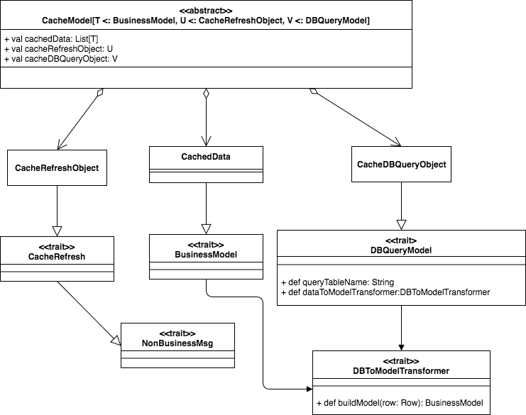

# Akka Cache
Building cache for akka actor based system in immutable way

The framework design which can be followed to build generic cache for akka system from database data. The application would require to cache business objects, that would require to query the information from the database/external services or other external sources. The building cache would require three components:

1. Model for business objects to be cached
2. Refresh data 
3. Get Data from cache based on query pattern

The following UML diagram represents class modeling of caching objects in generic way. 

